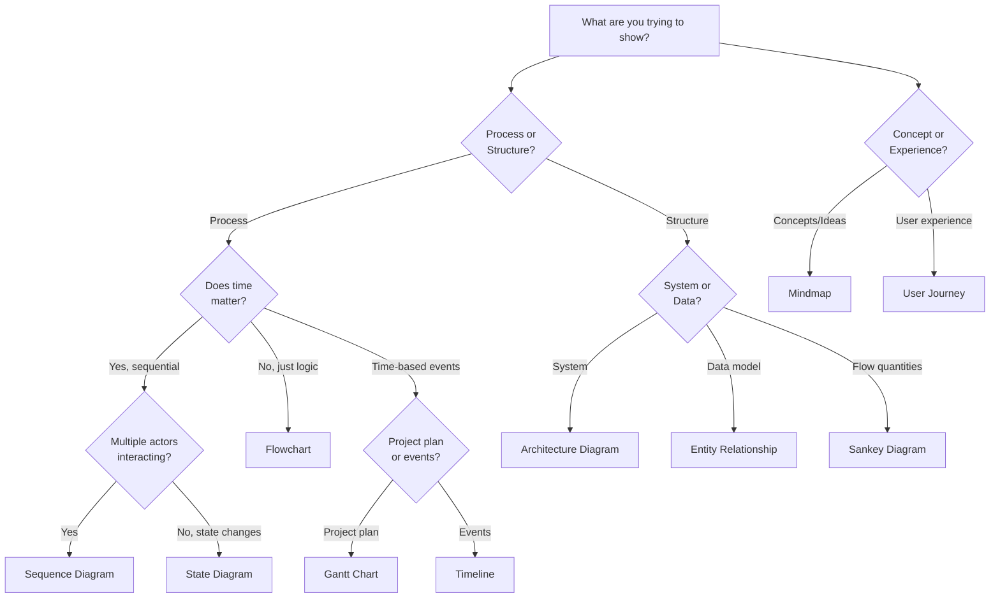

# Mermaid Diagrams

## Basic Frontmatter Syntax

All diagram customization uses frontmatter at the top of the diagram:

```
%%{init: {'theme':'dark'}}%%
```

For details on all configuration options, see `references/configuration.md` and `references/styling.md`.

## Workflow Selection

Determine whether the user wants to **create** a new diagram or **edit** an existing diagram:

- **Creating:** User requests a new diagram, asks to "draw", "create", "make", or "generate" a diagram
- **Editing:** User requests changes to an existing diagram, asks to "change theme", "update", "modify", "customize", or "edit"

Follow the appropriate workflow below based on the user's intent.

---

## Creating New Diagrams

Follow this workflow when creating new Mermaid diagrams:

### 1. Determine Diagram Type and Theme

If the user's request doesn't clearly indicate which diagram type or theme to use, **use the AskUserQuestion tool once** to ask both questions:

**Question 1 - Diagram Type:**
- **Flowchart** - Decision trees, algorithms, process flows
- **Sequence** - Time-ordered interactions between actors/components
- **State** - State machines, workflows, state transitions
- **Architecture** - System components and relationships
- **Entity Relationship** - Database schemas and data models
- **Gantt** - Project schedules and task dependencies
- **Timeline** - Chronological events and milestones
- **Mindmap** - Hierarchical concepts and brainstorming
- **User Journey** - User experience flows and touchpoints
- **Sankey** - Flow quantities and value relationships

**Question 2 - Theme:**
- **Default** - Most use cases, web documentation
- **Neutral** - Black and white printing or high contrast needs
- **Dark** - Dark mode websites, presentations on dark backgrounds
- **Forest** - Softer, nature-inspired aesthetic

Reference the selection flowchart below to guide your questions, or consult `references/diagrams/` for detailed examples of each type.

### 2. Create the Diagram

1. **Read the diagram type reference** in `references/diagrams/` for syntax examples and conventions
2. Apply the selected theme using frontmatter: `%%{init: {'theme':'selected-theme'}}%%`
3. Create the diagram in a markdown file

**Common Issues:**
- If encountering syntax errors or special character issues, read `references/conventions.md`
- For custom colors or theme variables, read `references/styling.md`
- For diagram-specific configuration options, read `references/configuration.md`

## Diagram Type Selection Guide

Use this flowchart to determine the appropriate diagram type:




---

## Editing Existing Diagrams

Follow this workflow when editing or customizing existing Mermaid diagrams:

### 1. Read the Existing Diagram

Use the Read tool to view the current diagram file and understand its structure.

### 2. Identify the Change Type

Determine what the user wants to modify:

- **Theme/Styling** - Change colors, fonts, visual appearance
- **Configuration** - Modify diagram-specific settings (layout, spacing, options)
- **Content** - Update nodes, edges, text, structure
- **Icons** - Add or change icons (architecture diagrams)

### 3. Apply Changes Based on Type

- **Theme/Styling** - Read `references/styling.md` for theme options, color customization, and theme variables
- **Configuration** - Read `references/configuration.md` for diagram settings, frontmatter syntax, and options
- **Content** - Read the diagram type reference in `references/diagrams/` for syntax
- **Icons** - Read `references/configuration.md` "Icon Registration" section (architecture diagrams only)

### 4. Make the Edit

Use the Edit tool to update the diagram file with the changes, preserving the existing structure and only modifying what the user requested.

---

## Additional Resources

### Reference Files

For detailed documentation, consult:
- **`references/configuration.md`** - Complete configuration options, frontmatter syntax, icon registration. Read when user wants to modify diagram settings, add icons, or change configuration.
- **`references/styling.md`** - Theming capabilities, all theme variables, color customization, examples. Read when user wants to change colors, themes, or visual appearance.
- **`references/conventions.md`** - Syntax guide, escaping special characters, layout best practices, performance tips, accessibility. Read when encountering syntax issues or layout problems.

### Diagram Type References

Located in `references/diagrams/`, each file includes use cases, complete examples with themes, and conventions:
- **Process & Flow**: flowchart.md, sequence.md, state.md, sankey.md
- **System Design**: architecture.md, entity-relationship.md
- **Planning & Timeline**: gantt.md, timeline.md
- **Conceptual**: mindmap.md, user-journey.md
