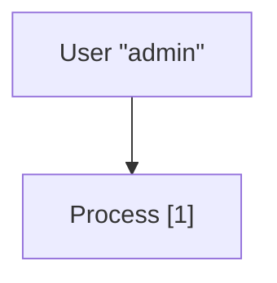
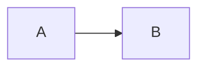
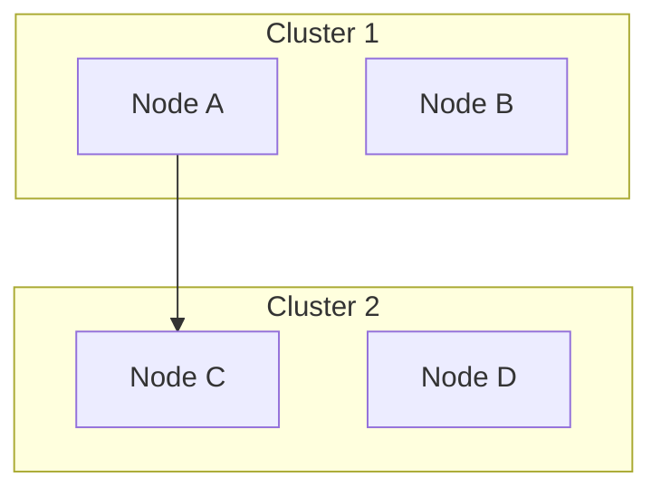
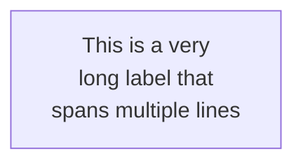

# Mermaid Conventions and Best Practices

## Diagram Declaration

All Mermaid diagrams must begin with a type declaration that identifies which diagram type to generate:

```
flowchart TD
sequenceDiagram
stateDiagram-v2
erDiagram
gantt
```

## Comments

Use `%%` for line comments to ignore anything following on that line:

```mermaid
flowchart TD
    A --> B  %% This is a comment
```

**Warning:** Avoid using curly braces `{}` within comments as they can confuse the renderer.

## Reserved Words

Certain words can break diagrams:
- **"end"** - Breaks flowcharts and sequence diagrams. Wrap in quotes: `"end"`
- Nested node shapes confuse the renderer - use quotation marks as a solution

## General Syntax

### Common Notation

- **Nodes**: `[Text]` for rectangles, `(Text)` for rounded, `{Text}` for diamonds
- **Data stores**: `[(Database)]` for cylinders
- **Arrows**: `-->` for directed, `---` for undirected
- **Labels**: `-->|Label|` for labeled edges

## Escaping Special Characters

Mermaid requires escaping for certain characters:

- Quotes: Use `#quot;` instead of `"`
- Brackets: Use `#91;` for `[` and `#93;` for `]`
- Braces: Use `#123;` for `{` and `#125;` for `}`
- Hash: Use `#35;` for `#`

Example:


## Layout Control

### Direction

Specify diagram direction:
- `TB` or `TD` - Top to Bottom
- `BT` - Bottom to Top
- `LR` - Left to Right
- `RL` - Right to Left



### Subgraphs

Group related nodes:



**Nesting limitation**: Keep to 2-3 levels maximum for readability.

## Mermaid Limitations

### Layout Constraints

- **Automatic positioning**: Limited control over node positioning
- **Edge routing**: Cannot manually adjust edge paths
- **Subgraph nesting**: Maximum 2-3 levels for readability

### Styling Constraints

- **Theme-based only**: Individual element styling is limited
- **No per-element customization**: Use themes instead

For complete theming information, see `styling.md`.

## Common Pitfalls

### Long Labels

Long labels can break layout. Use line breaks:



### Edge Crossing

Automatic layout may create edge crossings. Workarounds:
- Reorder node definitions
- Use subgraphs to group related nodes
- Switch direction (TB vs LR)
- Add invisible edges to influence layout

### Special Characters in IDs

Avoid spaces and special characters in node IDs:

```mermaid
graph TD
    nodeA[Node A]  %% Good: ID is nodeA
    node-b[Node B] %% Good: ID is node-b
```

## Performance Considerations

- Large diagrams (100+ nodes) may render slowly
- Limit subgraph nesting to 2-3 levels
- Break very large diagrams into multiple smaller ones
- Use simple node shapes for better performance

## Browser Compatibility

Mermaid requires modern browsers with:
- SVG support
- ES6 JavaScript support
- CSS3 support

Works best in:
- Chrome/Edge 90+
- Firefox 88+
- Safari 14+

## Accessibility

- Add meaningful labels to all nodes and edges
- Use high-contrast themes (`neutral` or `dark`) when needed
- Consider color-blind friendly palettes in custom themes
- Keep diagrams simple for screen reader compatibility
