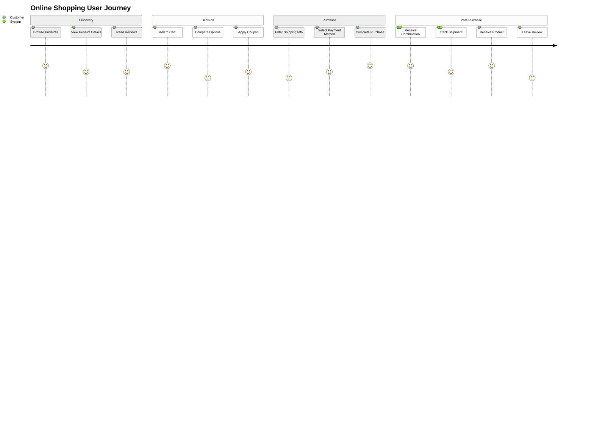

# User Journey

## When to Use

Use user journey diagrams for:
- Mapping user experience flows
- Identifying pain points and opportunities
- Documenting user interactions
- Service design documentation

## Example

## Key Conventions

- Use `section` to group journey stages
- Format: `Task Name: Score: Actor1, Actor2`
- Score ranges from 1-5 (1=very negative, 5=very positive)
- List actors involved in each step
- Order steps chronologically
- Include emotional highs and lows through scores
- Consider multiple actors (customer, system, support)
- Focus on key touchpoints in the experience
