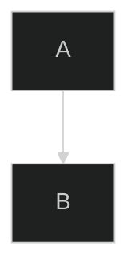
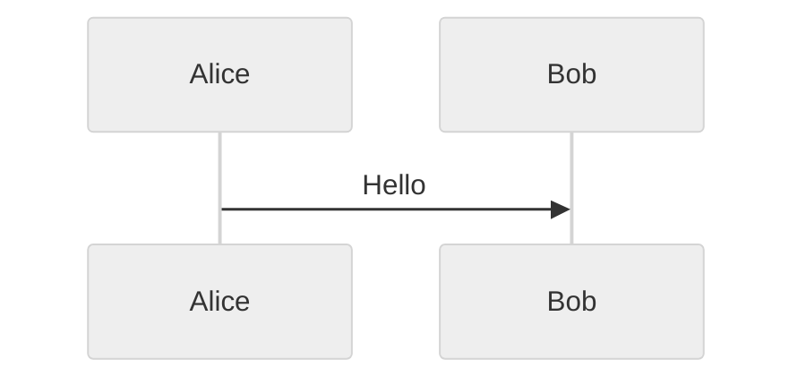
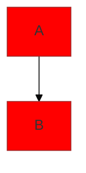
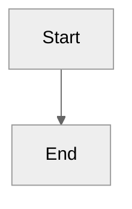

# Mermaid Configuration Reference

## Configuration Methods

Mermaid supports three hierarchical configuration levels:

1. **Default configuration** - Built-in base settings
2. **Site-wide configuration** - Set via `mermaid.initialize()` (applies to all diagrams)
3. **Diagram-level configuration** - Frontmatter or directives (overrides site settings)

**Priority Order:** Frontmatter > Site config > Default config

## Frontmatter Configuration (Recommended)

Use frontmatter at the top of diagrams to override configuration. This is the preferred method for diagram-specific settings.

**Syntax:**
```
%%{init: {'key': 'value', 'nested': {'key': 'value'}}}%%
```

**Basic Example:**


**With Diagram-Specific Config:**


**With Theme Variables:**


## Site-Wide Configuration

Use `mermaid.initialize()` to set defaults for all diagrams. Called once during setup.

**Example:**
```javascript
import mermaid from 'mermaid';

mermaid.initialize({
  startOnLoad: true,
  theme: 'default',
  logLevel: 'info',
  securityLevel: 'loose',
  flowchart: {
    useMaxWidth: true,
    htmlLabels: true
  }
});
```

## Key Configuration Options

### General Settings

- **theme** - `'default'`, `'neutral'`, `'dark'`, `'forest'`, `'base'`
- **fontFamily** - CSS font family string
- **logLevel** - `'fatal'`, `'error'`, `'warn'`, `'info'`, `'debug'`, `'trace'`
- **securityLevel** - `'strict'`, `'loose'`, `'antiscript'`, `'sandbox'`
- **startOnLoad** - `true` or `false` (auto-render on page load)

### Diagram-Specific Settings

Each diagram type supports specific configuration under its key:

**Flowchart:**
```javascript
{
  flowchart: {
    useMaxWidth: true,
    htmlLabels: true,
    curve: 'basis',
    diagramPadding: 8
  }
}
```

**Sequence:**
```javascript
{
  sequence: {
    mirrorActors: true,
    showSequenceNumbers: false,
    actorMargin: 50,
    boxMargin: 10,
    messageMargin: 35
  }
}
```

**Gantt:**
```javascript
{
  gantt: {
    titleTopMargin: 25,
    barHeight: 20,
    barGap: 4,
    numberSectionStyles: 4
  }
}
```

## Directives (Deprecated)

**Note:** Directives are deprecated since v10.5.0. Use frontmatter with the `init` key instead.

**Old directive syntax (don't use):**
```
%%{initialize: {'theme': 'dark'}}%%
```

**New frontmatter syntax (use this):**
```
%%{init: {'theme': 'dark'}}%%
```

## Configuration Best Practices

### For Diagram Authors

**Always use frontmatter** unless you're setting up site-wide defaults:



### For Site Integrators

Use `initialize()` for site-wide defaults:

```javascript
mermaid.initialize({
  theme: 'default',
  startOnLoad: true,
  securityLevel: 'strict'
});
```

### Security Considerations

Secure configuration keys can only be set via `initialize()` and cannot be overridden by diagram authors:

- `secure`
- `securityLevel`
- `startOnLoad`
- `maxTextSize`

## Complete Configuration Schema

For the complete list of all available configuration options, see:
- [Mermaid Config Schema Documentation](https://mermaid.js.org/config/schema-docs/config.html)
- [Configuration Guide](https://mermaid.js.org/config/configuration.html)

## Icon Registration

Register custom icon packs to use in diagrams (available for architecture diagrams).

**Using CDN:**
```javascript
mermaid.registerIconPacks([
  {
    name: 'logos',
    loader: () =>
      fetch('https://unpkg.com/@iconify-json/logos@1/icons.json')
        .then((res) => res.json()),
  },
]);
```

**Using npm package (with lazy loading):**
```javascript
import mermaid from 'mermaid';

mermaid.registerIconPacks([
  {
    name: 'logos',
    loader: () =>
      import('@iconify-json/logos').then((module) => module.icons),
  },
]);
```

**Direct import:**
```javascript
import { icons } from '@iconify-json/logos';

mermaid.registerIconPacks([
  {
    name: icons.prefix,
    icons,
  },
]);
```

**Using icons in diagrams:**


Icon packs are sourced from [icones.js.org](https://icones.js.org/) with over 200,000+ available icons.
