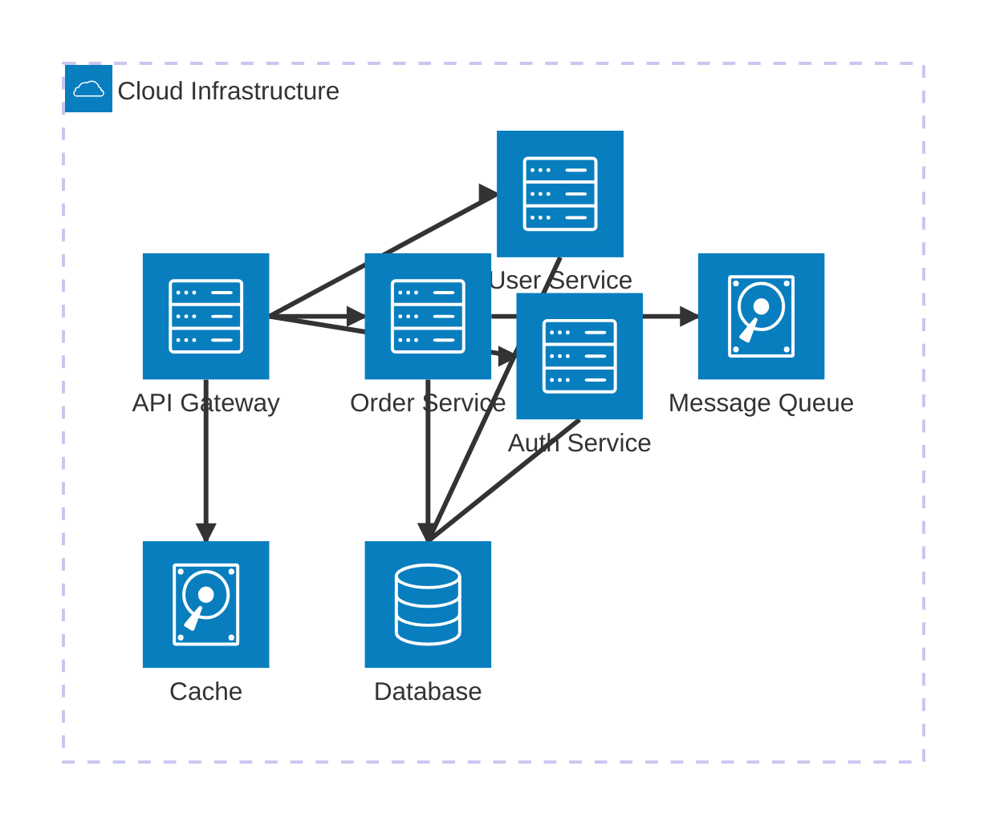

# Architecture Diagram

## When to Use

Use architecture diagrams for:
- System component relationships
- High-level service topology
- Microservices architecture
- Infrastructure overview

## Example

## Key Conventions

- Use `group` to define logical boundaries (cloud, VPC, subnet)
- Use `service` with type icons: `server`, `database`, `disk`
- Define directional connections: `L` (left), `R` (right), `T` (top), `B` (bottom)
- Group related services within the same boundary
- Show data stores separately from compute services
- Label groups with infrastructure context
- Keep layout clean by minimizing crossing lines
