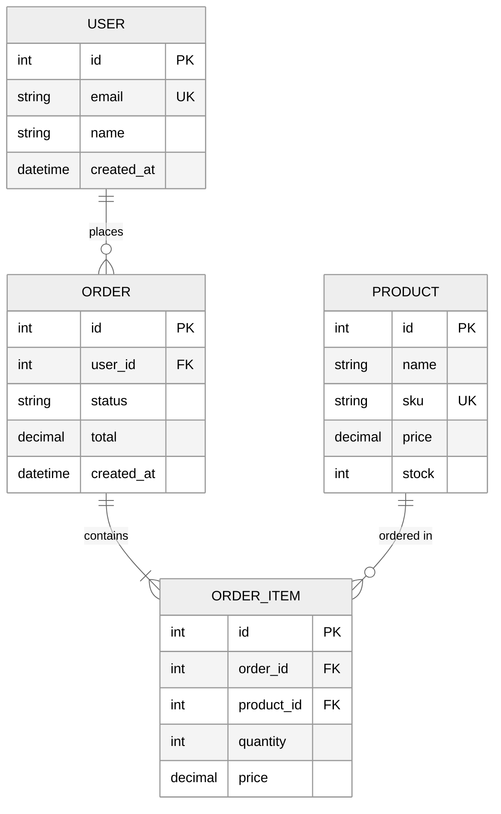

# Entity Relationship Diagram

## When to Use

Use entity relationship diagrams for:

- Database schema design
- Data model documentation
- Table relationships
- Cardinality mapping

## Example

## Key Conventions

- Use `||--o{` notation for relationship cardinality:
  - `||--||` one to one
  - `||--o{` one to zero or more
  - `||--|{` one to one or more
- Mark primary keys with `PK`
- Mark foreign keys with `FK`
- Mark unique constraints with `UK`
- Include data types for each field
- List important constraints and indexes
- Show relationship names on the connecting lines
