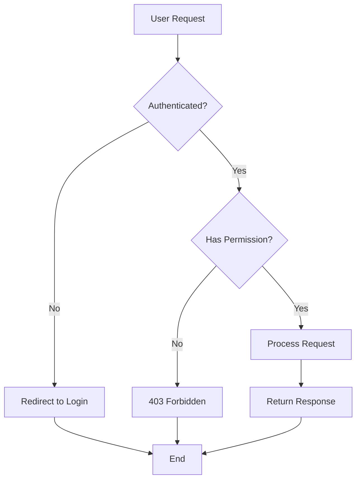

# Flowchart

## When to Use

Use flowcharts for:
- Decision trees and branching logic
- Algorithm visualization
- Process flows without timing constraints
- Control flow in systems

## Example

## Key Conventions

- Use diamond shapes `{}` for decision points
- Use rectangles `[]` for actions/processes
- Use rounded rectangles `()` for start/end points
- Label edges with conditions for decisions
- Keep flow direction consistent (top-to-bottom or left-to-right)
- Use descriptive labels that explain what happens at each step
