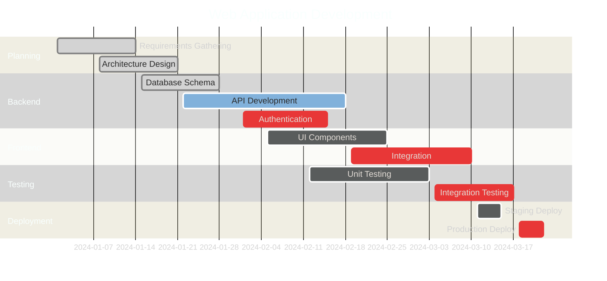

# Gantt Chart

## When to Use

Use Gantt charts for:
- Project schedules and timelines
- Task dependencies and sequencing
- Resource planning
- Sprint planning

## Example

## Key Conventions

- Set `dateFormat` to match your date strings
- Use sections to group related tasks
- Mark critical path tasks with `:crit`
- Show completed tasks with `:done`
- Show current work with `:active`
- Include task IDs for dependency tracking
- Use clear, action-oriented task names
- Show dependencies between tasks when relevant
