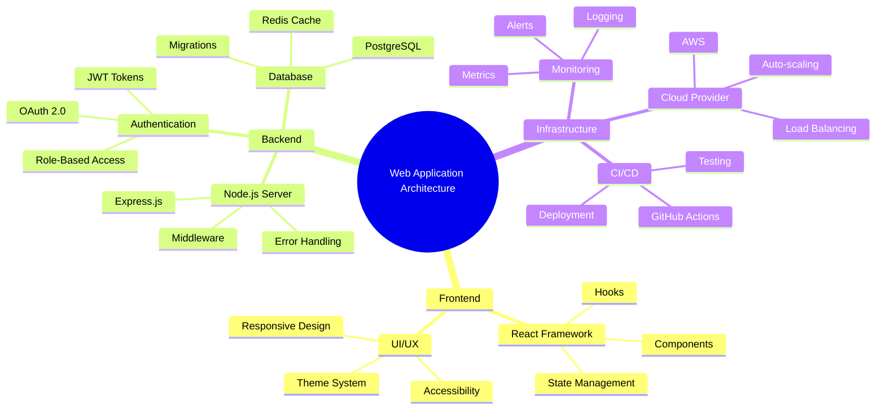

# Mindmap

## When to Use

Use mindmaps for:
- Brainstorming and idea organization
- Hierarchical concept mapping
- Knowledge structure visualization
- Topic breakdown and exploration

## Example

## Key Conventions

- Start with `root((text))` for the central concept
- Use indentation to show hierarchy
- Keep each node concise (1-4 words)
- Organize related concepts under common parents
- Limit depth to 3-4 levels for readability
- Use consistent terminology
- Order siblings by importance or logical flow
