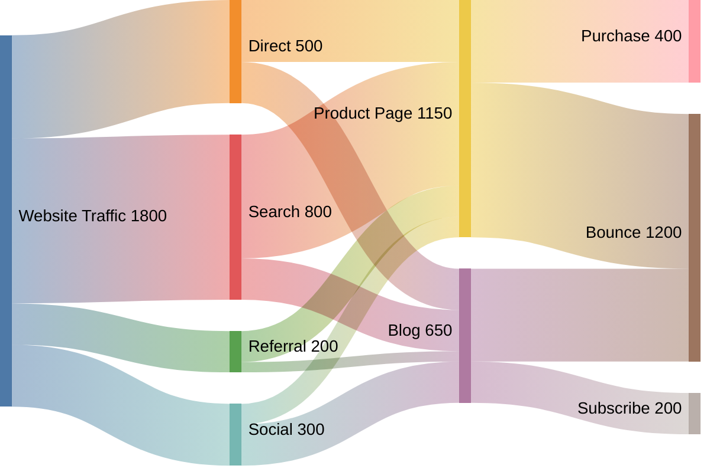

# Sankey Diagram

## When to Use

Use Sankey diagrams for:
- Flow quantities and value relationships
- Resource allocation visualization
- Traffic flow analysis
- Budget or energy distribution

## Example

## Key Conventions

- Each line represents a flow: Source, Target, Value
- Width of flow is proportional to the value
- Organize flows left-to-right showing progression
- Use meaningful labels for sources and targets
- Values should be numeric and represent flow quantity
- Group related flows together in the definition
- Consider using for conversion funnels, resource flows, or traffic analysis
