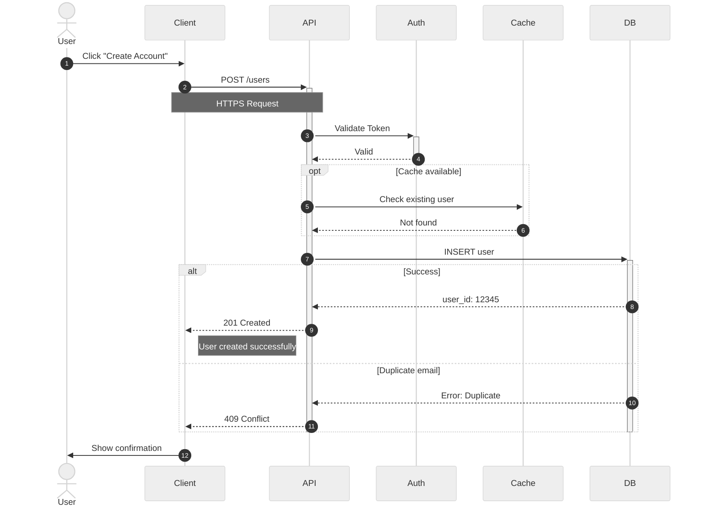

# Sequence Diagram

## When to Use

Use sequence diagrams for:

- Time-ordered interactions between actors/components
- API request/response flows
- Message passing between systems
- Protocol interactions

## Complete Example



## Features & Syntax

### Participants

Define actors in the sequence. Participants appear in the order declared or first used.

**Explicit Declaration:**

```
participant Client
participant API
participant Database as DB
```

**Actor Symbol:**

```
actor User
participant System
```

**Specialized Symbols:**

```
participant B as Boundary
participant C as Control
participant E as Entity
participant D as Database
participant Q as Queue
participant Col as Collections
```

### Message Arrows

Ten arrow types for different interaction patterns.

**Synchronous (solid line):**

```
Alice->>Bob: Synchronous call
Alice->Bob: Solid line without arrow
```

**Asynchronous (dotted line):**

```
Alice-->>Bob: Response
Alice-->Bob: Dotted without arrow
Alice--)Bob: Async with open arrow
```

**Special:**

```
Alice-xBob: Call with cross (rejection)
Alice<<->>Bob: Bidirectional arrows
```

### Activation Boxes

Show when a participant is actively processing.

**Using activate/deactivate:**

```
Alice->>Bob: Request
activate Bob
Bob-->>Alice: Response
deactivate Bob
```

**Using +/- suffix:**

```
Alice->>+Bob: Request
Bob-->>-Alice: Response
```

**Stacked activations:**

```
Alice->>+Bob: First call
Bob->>+Bob: Self call
Bob-->>-Bob: Complete self
Bob-->>-Alice: Complete first
```

### Control Flow

**Loop:**

```
loop Every minute
    Service->>API: Health check
    API-->>Service: OK
end
```

**Alt/Else (conditional):**

```
alt Successful case
    API-->>Client: 200 OK
else Error case
    API-->>Client: 500 Error
end
```

**Opt (optional):**

```
opt Cache available
    API->>Cache: Get data
    Cache-->>API: Return data
end
```

**Parallel:**

```
par Request to Service A
    Client->>ServiceA: Call A
and Request to Service B
    Client->>ServiceB: Call B
end
```

**Critical Region:**

```
critical Establish connection
    Service->>DB: Connect
option Network timeout
    Service->>Service: Retry
end
```

**Break:**

```
loop Process items
    Service->>Queue: Get item
    break When queue empty
        Service->>Service: Stop
    end
end
```

### Notes

Add explanatory text to diagrams.

**Positioned notes:**

```
Note right of Alice: Text on right
Note left of Bob: Text on left
Note over Alice: Text above Alice
```

**Spanning notes:**

```
Note over Alice,Bob: Text spanning both
```

**Multi-line notes:**

```
Note over Alice: Line 1<br/>Line 2<br/>Line 3
```

### Background Highlighting

Add colored rectangles around sections.

**Basic:**

```
rect rgb(200, 220, 240)
    Alice->>Bob: Inside colored box
    Bob-->>Alice: Response
end
```

**With label:**

```
rect rgba(0, 255, 0, 0.1)
    note right of Alice: Authentication Flow
    Alice->>Bob: Login
end
```

### Sequence Numbering

Automatically number messages.

**Auto-numbering:**

```
sequenceDiagram
    autonumber
    Alice->>Bob: First message
    Bob-->>Alice: Second message
```

### Actor Creation & Destruction

Show lifecycle of participants (v10.3.0+).

**Creation:**

```
Alice->>Bob: Request
create participant Service
Bob->>Service: Initialize
```

**Destruction:**

```
Service->>Bob: Complete
destroy Service
```

## Key Conventions

- Use `->>` for synchronous calls, `-->>` for responses
- Use `activate`/`deactivate` to show processing time
- Order participants left-to-right by typical call flow
- Include HTTP methods and paths in API calls
- Show error paths when relevant using alt/else
- Keep messages concise but descriptive
- Use notes to clarify complex interactions
- Escape special characters: use `#quot;` for quotes, `#91;` for [, `#93;` for ]
