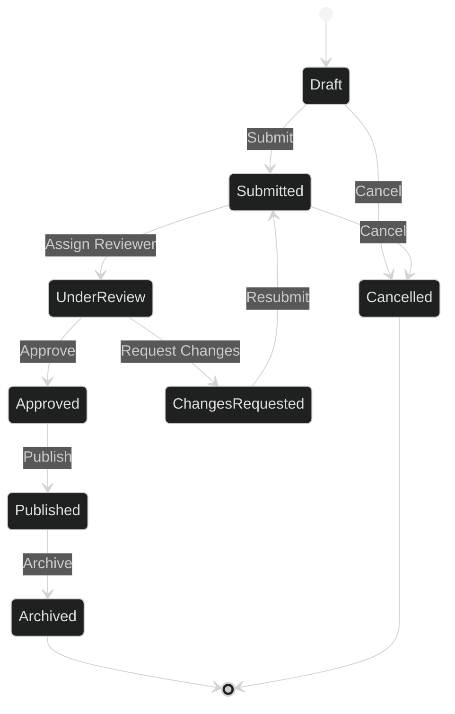

# State Diagram

## When to Use

Use state diagrams for:

- State machines and workflows
- Object lifecycle management
- System mode transitions
- Order/request status tracking

## Example

## Key Conventions

- Start with `[*]` to indicate initial state
- End with `[*]` to indicate terminal states
- Label transitions with trigger events or actions
- Group related states visually when possible
- Show all valid state transitions
- Include error/cancellation paths
- Use descriptive state names (not just numbers/codes)
