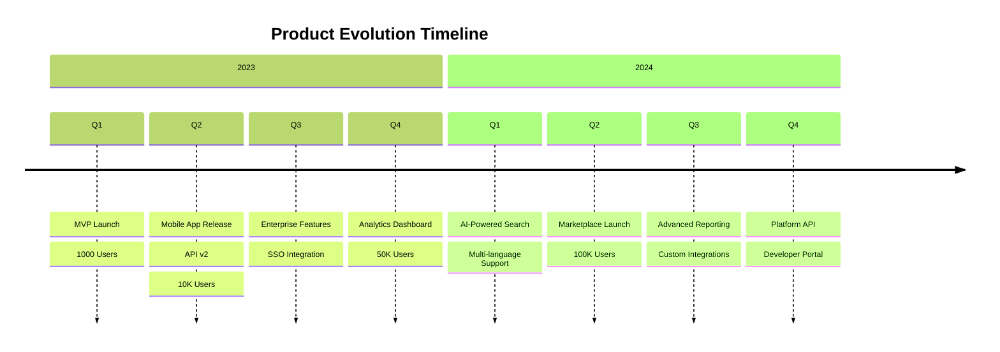

# Timeline

## When to Use

Use timelines for:
- Chronological event sequences
- Product roadmap visualization
- Historical milestones
- Release history

## Example

## Key Conventions

- Use `section` to group time periods (years, quarters, months)
- Each entry represents an event or milestone
- Use `:` to separate multiple events in the same period
- Keep event descriptions concise
- Order sections chronologically
- Include metrics or achievements when relevant
- Use consistent time period granularity
