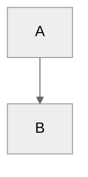
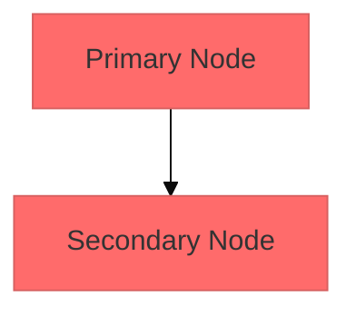
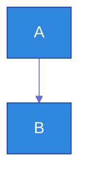
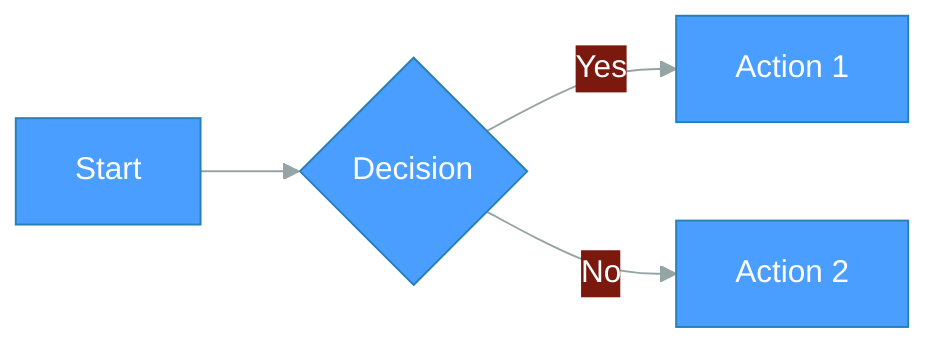
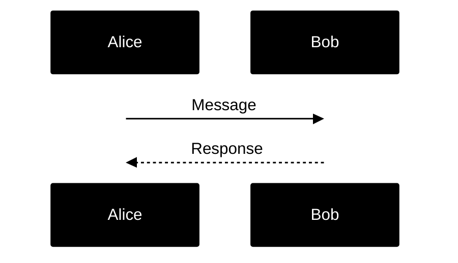
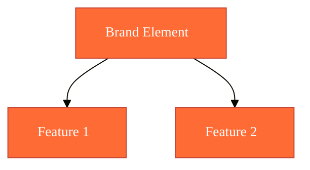

# Mermaid Styling & Theming Reference

## Available Themes

Mermaid provides five built-in themes:

1. **default** - Standard theme for all diagrams
2. **neutral** - Ideal for black and white printing and high contrast
3. **dark** - Optimized for dark mode websites and presentations
4. **forest** - Features green color palettes
5. **base** - **The only theme that can be modified** - Use as foundation for customizations

## Applying Themes

### Diagram-Level (YAML Frontmatter - Recommended)

Apply themes to individual diagrams using YAML frontmatter:



### Site-Wide (Initialize)

Set default theme for all diagrams:

```javascript
mermaid.initialize({
  theme: 'dark',
  themeVariables: {
    primaryColor: '#ff0000'
  }
});
```

## Theme Customization

**Important:** Only the `base` theme supports customization via `themeVariables`.

### Basic Customization



### Advanced Customization



## Theme Variables Reference

### Color Format Requirements

**Critical:** The theming engine only recognizes hex colors, not color names.

- ✓ Valid: `#ff0000`, `#FF0000`
- ✗ Invalid: `red`, `blue`, `rgb(255,0,0)`

### General Variables

| Variable | Default | Description |
|----------|---------|-------------|
| `darkMode` | `false` | Affects derived color calculations. Set to `true` for dark mode |
| `background` | `#f4f4f4` | Base background color for calculating contrasts |
| `fontFamily` | `trebuchet ms, verdana, arial` | Font family for diagram text |
| `fontSize` | `16px` | Font size in pixels |
| `primaryColor` | `#fff4dd` | Primary node background (other colors derive from this) |
| `primaryTextColor` | Auto-calculated | Text color in nodes using primaryColor |
| `primaryBorderColor` | Auto-calculated | Border color for primary nodes |
| `secondaryColor` | Auto-calculated | Secondary node background |
| `secondaryTextColor` | Auto-calculated | Text in secondary nodes |
| `secondaryBorderColor` | Auto-calculated | Border for secondary nodes |
| `tertiaryColor` | Auto-calculated | Tertiary node background |
| `tertiaryTextColor` | Auto-calculated | Text in tertiary nodes |
| `tertiaryBorderColor` | Auto-calculated | Border for tertiary nodes |
| `noteBkgColor` | `#fff5ad` | Background for notes |
| `noteTextColor` | `#333` | Text in note rectangles |
| `noteBorderColor` | Auto-calculated | Border for notes |
| `lineColor` | Auto-calculated | Line color for connections |
| `textColor` | Auto-calculated | Text over background (labels, titles) |
| `mainBkg` | Auto-calculated | Background for flowchart objects |
| `errorBkgColor` | `tertiaryColor` | Syntax error message background |
| `errorTextColor` | `tertiaryTextColor` | Syntax error message text |

### Flowchart Variables

| Variable | Default | Description |
|----------|---------|-------------|
| `nodeBorder` | `primaryBorderColor` | Node border color |
| `clusterBkg` | `tertiaryColor` | Background in subgraphs |
| `clusterBorder` | `tertiaryBorderColor` | Cluster border color |
| `defaultLinkColor` | `lineColor` | Link color |
| `titleColor` | `tertiaryTextColor` | Title color |
| `edgeLabelBackground` | Auto-calculated | Edge label background |
| `nodeTextColor` | `primaryTextColor` | Text inside nodes |

### Sequence Diagram Variables

| Variable | Default | Description |
|----------|---------|-------------|
| `actorBkg` | `mainBkg` | Actor background color |
| `actorBorder` | `primaryBorderColor` | Actor border color |
| `actorTextColor` | `primaryTextColor` | Actor text color |
| `actorLineColor` | `actorBorder` | Actor line color |
| `signalColor` | `textColor` | Signal color |
| `signalTextColor` | `textColor` | Signal text color |
| `labelBoxBkgColor` | `actorBkg` | Label box background |
| `labelBoxBorderColor` | `actorBorder` | Label box border |
| `labelTextColor` | `actorTextColor` | Label text color |
| `loopTextColor` | `actorTextColor` | Loop text color |
| `activationBorderColor` | Auto-calculated | Activation border |
| `activationBkgColor` | `secondaryColor` | Activation background |
| `sequenceNumberColor` | Auto-calculated | Sequence number color |

### State Diagram Variables

| Variable | Default | Description |
|----------|---------|-------------|
| `labelColor` | `primaryTextColor` | Label color for states |
| `altBackground` | `tertiaryColor` | Background in deep composite states |

### Class Diagram Variables

| Variable | Default | Description |
|----------|---------|-------------|
| `classText` | `textColor` | Text color in class diagrams |

### Pie Chart Variables

| Variable | Default | Description |
|----------|---------|-------------|
| `pie1` to `pie12` | Various | Fill colors for pie sections 1-12 |
| `pieTitleTextSize` | `25px` | Title text size |
| `pieTitleTextColor` | `taskTextDarkColor` | Title text color |
| `pieSectionTextSize` | `17px` | Section label text size |
| `pieSectionTextColor` | `textColor` | Section label text color |
| `pieLegendTextSize` | `17px` | Legend text size |
| `pieLegendTextColor` | `taskTextDarkColor` | Legend text color |
| `pieStrokeColor` | `black` | Pie section border color |
| `pieStrokeWidth` | `2px` | Pie section border width |
| `pieOuterStrokeWidth` | `2px` | Outer circle border width |
| `pieOuterStrokeColor` | `black` | Outer circle border color |
| `pieOpacity` | `0.7` | Pie section opacity |

### User Journey Variables

| Variable | Default | Description |
|----------|---------|-------------|
| `fillType0` to `fillType7` | Various | Fill colors for journey sections 1-8 |

## Color Derivation

Many colors are automatically calculated from base colors:

**Derived from `primaryColor`:**
- `primaryBorderColor` - Adjusted hue/brightness
- `primaryTextColor` - Contrast-calculated
- `secondaryColor` - Color shift
- `tertiaryColor` - Color shift

**Derived from `background`:**
- `lineColor` - Contrast-calculated
- `textColor` - Contrast-calculated

**Tip:** Override auto-calculated colors explicitly if the defaults don't match your design.

## Styling Examples

### Dark Mode Theme



### High Contrast Theme



### Branded Theme



## Best Practices

### Use YAML Frontmatter for Diagram-Specific Styling

Always use YAML frontmatter configuration unless setting site-wide defaults:

```mermaid
---
config:
  theme: base
  themeVariables:
    primaryColor: '#custom'
---
```

### Start with Base Theme for Customization

Only the `base` theme accepts `themeVariables`:

```
---
config:
  theme: base
  themeVariables:
    # custom variables here
---
```

### Use Hex Colors Only

Color names will not work:
- ✓ `'#ff0000'`
- ✗ `'red'`

### Leverage Auto-Calculated Colors

Set `primaryColor` and let Mermaid derive related colors automatically. Override only when needed:

```javascript
{
  'primaryColor': '#2e86de'  // Others derive automatically
}
```

### Test in Target Environment

Preview diagrams in the actual context (light/dark mode, print) to ensure readability.

## Common Styling Patterns

### Minimal Customization

Change only theme without variables:

```
---
config:
  theme: dark
---
```

### Single Color Adjustment

Modify one color, let others derive:

```
---
config:
  theme: base
  themeVariables:
    primaryColor: '#2ecc71'
---
```

### Full Custom Theme

Override multiple variables for complete control:

```
---
config:
  theme: base
  themeVariables:
    primaryColor: '#custom1'
    secondaryColor: '#custom2'
    background: '#custom3'
    lineColor: '#custom4'
---
```

## Troubleshooting

**Issue:** Custom colors not applying
- **Solution:** Ensure using `base` theme, not `default`/`neutral`/`dark`/`forest`

**Issue:** Color names don't work
- **Solution:** Use hex format (`#ff0000`) instead of names (`red`)

**Issue:** Theme not applying to specific diagram
- **Solution:** Check YAML frontmatter syntax, ensure `config` key is used with proper indentation

**Issue:** Site-wide theme conflicts with diagram theme
- **Solution:** Diagram frontmatter overrides site config - this is expected behavior
